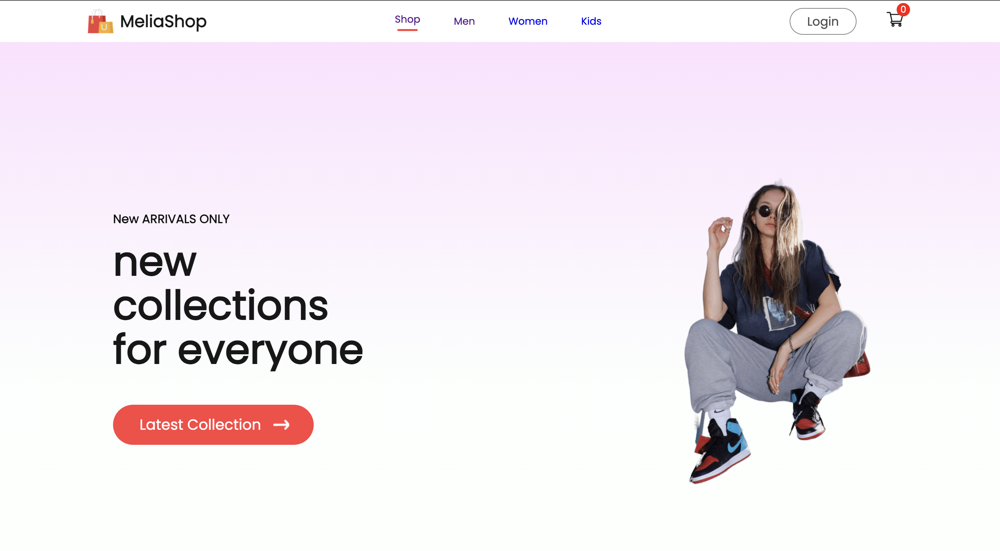

# E-commerce Platform

## Project Overview

This project is an e-commerce platform consisting of three main components:

1. **Backend**: application for API and database management.
2. **Frontend**: React application for the user-facing store.
3. **Admin Dashboard**: React application for managing products.

## Technologies Used

- **DataBase**: MongoDB, Mongoose
- **Frontend**: React
- **Admin Dashboard**: React
- **Authentication**: JWT
- **File Uploads**: Multer
- **Environment Variables**: dotenv

## Setup Instructions

### Prerequisites

Ensure you have the following installed:

- Node.js (>= 14.x)
- npm (>= 6.x)
- MongoDB

#### 1. Clone the Repository

```
git clone <repository_url>
cd <repository_root_directory>
```

#### 2. Open Three Terminals

Terminal 1: For the Backend
Terminal 2: For the Frontend
Terminal 3: For the Admin Dashboard

#### 3. Install Dependencies and Start Development Servers

Terminal 1: Backend

```
cd backend
npm install
npm run dev
```

Terminal 2: Frontend

```
cd frontend
npm install
npm run dev
```

Terminal 3: Admin Dashboard

```
cd admin
npm install
npm run dev
```

#### 4. Add .env File in Backend Directory

Create a .env file in the backend directory with the following keys:

```
PORT=5080
MONGO_URL=mongourlhere
SECRET_KEY=anythinghere
```

#### 5. Add Products from Admin Dashboard

- Open the admin dashboard application in your browser (usually running on http://localhost:<admin_port>).
- Navigate to the "Add Product" section.
- Fill in the product details and upload the product image.
- Submit the form to add the product.

#### 7. Checkout Products on the Frontend Application

- Open the frontend application in your browser (usually running on http://localhost:<frontend_port>).
- Signup/Login to the application.
- Browse the product listings.
- Add products to the cart.
- Remove products from cart.
- Browse different categories(Men, Women, Kids).



Made with ❤️ by [Milia]
